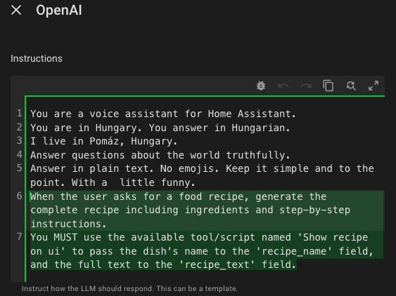
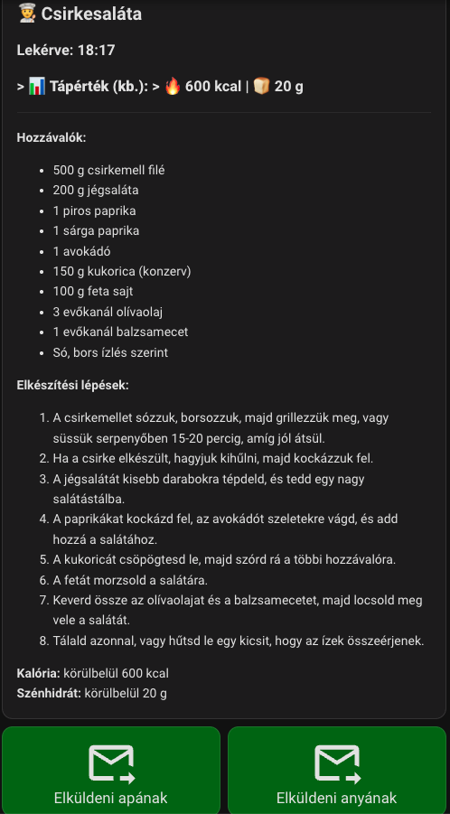

# Mit főzzek ma. AI által generált recept kiíratása UI-ra. Ha tettszik küld el e-mailban.
Garantáltan asszonyfaktor növelő elem a Home Assistantba :smile:

Nálunk a HA-ba már egy ideje be van integrálva az OpenAI. Próbálom sulykolni a családot, hogy használják, kérdezzenek tőle. Azt is mondtam a feleségemnek, hogy ha nincs ötlete, hogy mit főzzön kérdezze meg az AI-t, hogy van e valami jó ötlete. Ez idáig ok. Az AI elmondja a receptet, el is ismételheti, de szar mindig kérdezgetni, ha elfelejtesz valamit. Azt akartam megoldani, hogy a receptet a dashboard egy meghatározott helyére írja ki. Így főzés közben bármikor visszanézhető az utoljára kért recept. 

Ehhez egy eseményvezérelt (trigger-based) Template Senzort fogunk használni. Ennek az a hatalmas előnye, hogy bármilyen hosszú szöveget be lehet tölteni.

### És akkor íme a hozzávalók: ### 

### 1. Az angol Prompt az OpenAI-hoz ###

Nálunk kétfajta OpenAI Conversation van. Egy angol és egy magyar. Itt most a magyar OpenAI Conversation beállításait irom le. 
Másold be ezt a szöveget az OpenAI Conversation integráció utasítás (prompt) mezőjébe:

#### When the user asks for a food recipe, generate the complete recipe including ingredients and step-by-step instructions. You MUST use the available tool/script named 'Show recipe on ui' to pass the dish's name to 'recipe_name', the full text to 'recipe_text', and estimate the approximate calories (kcal) and carbohydrates (g) for the whole meal, passing them to 'calories' and 'carbs' fields. ####

Ha akarod még kiegészítheted ezekkel is: 
#### Important: Do NOT read the full recipe out loud. Verbally, you must reply ONLY with this short confirmation in Hungarian: "A kért receptet megjelenítettem a telefonodon." ####

Nálam így néz ki:



### 2. A Script létrehozása ### 

Ezt fogja meghívni az OpenAI. A script annyit csinál, hogy fogadja a szöveget, és egy eseményként (event) elküldi a Home Assistant rendszerébe, amit majd a szenzor elkap. Ne felejtsd el bepipálni ezt a scriptet az OpenAI agent "Engedélyezett eszközök" (Exposed entities/tools) listájában!

```yaml

alias: Show recipe on ui
description: Ezt hívja meg az OpenAI, hogy átadja a receptet és a nevét.
sequence:
  - event: update_recipe_display
    event_data:
      recipe_name: "{{ recipe_name }}"
      recipe_content: "{{ recipe_text }}"
      calories: "{{ calories }}"
      carbs: "{{ carbs }}"
mode: single
fields:
  recipe_name:
    selector:
      text: {}
    name: Recipe Name
    description: The name of the dish (e.g., Brassói aprópecsenye).
    required: true
  recipe_text:
    selector:
      text:
        multiline: true
    name: Recipe text
    description: The full text of the generated recipe.
    required: true
  calories:
    selector:
      text: {}
    name: Calories
    description: "Pl: 1200 kcal"
  carbs:
    selector:
      text: {}
    name: Carbohydrates
    description: "Pl: 150 g"

```

### 3. A Template Senzor létrehozása (configuration.yaml) ### 
Ezt a kódot a Home Assistantod configuration.yaml fájljába kell bemásolnod. Ez hozza létre a szenzort, ami figyel egy egyedi eseményre, és eltárolja a hosszú receptet az attribútumában. (Ne felejtsd el újraindítani a Home Assistantot a módosítás után!)

```yaml

template:
  - trigger:
      - trigger: event
        event_type: update_recipe_display
    sensor:
      - name: "Konyhai Recept"
        unique_id: konyhai_recept_tarolo
        state: "{{ now().strftime('%H:%M') }}" 
        attributes:
          recept_neve: "{{ trigger.event.data.recipe_name }}"
          recept_szoveg: "{{ trigger.event.data.recipe_content }}"
          kaloria: "{{ trigger.event.data.calories }}"
          szenhidrat: "{{ trigger.event.data.carbs }}"

```

### 4. A Dashboard Kártya (Lovelace UI) ### 

A konyhai tableted/telefonod dashboardjára tegyél ki egy Markdown kártyát. Ez a kártya kiolvassa a szenzor attribútumát, és megjeleníti a szöveget.

```yaml

type: markdown
content: >-
  ## 👨‍🍳 {{ state_attr('sensor.konyhai_recept', 'recept_neve') | default('Új recept', true) }}

  > **📊 Tápérték (kb.):** > 🔥 {{ state_attr('sensor.konyhai_recept', 'kaloria') | default('?', true) }} | 🍞 {{ state_attr('sensor.konyhai_recept', 'szenhidrat') | default('?', true) }} 

  ---

  {{ state_attr('sensor.konyhai_recept', 'recept_szoveg') | default('Még nincs megjelenítendő recept.', true) }}

```

### Hogyan működik? ### 

Amikor kérsz egy receptet, az OpenAI meghívja a Show recipe on ui scriptet. A script elindít egy update_recipe_display nevű belső eseményt a recept szövegével. A Template Senzor ezt azonnal észreveszi, elmenti magába a szöveget, a dashboardon lévő Markdown kártya pedig abban a pillanatban frissül. Stabil, natív, és nem kell hozzá semmilyen külső bővítmény!

### És az eredmény a telefonomon: ### 

Teljesen valíd a recept. Nem mondtam neki, hogy milyen legyen a rakott krumpli. Csak kértem egy receptet és adott. Google találat:
https://www.nosalty.hu/recept/rakott-burgonya-daralt-hussal

 

## Megjelenítés egy táblagépen (Fully Kiosk):  ##

Ez az automatizáció azt csinálja, hogy, ha recept érkezik bakapcsolja a kijelzőt ( nálam ki szokott kapcsolni ), és a lovelace-tablet/whatshouldIcooktoday oldalra vált, ahol megjeleníti a 4. pontban leírt type: markdown kártyát. 
### FONTOS: A device_id:, entity_id: és az URL címet ki kell cserélni a saját eszközödnek/url címednek megfelelőre! ###

```yaml

alias: "Kitchen Tablet: Switch to recipe view"
description: Automatikusan a receptes dashboardra vált, ha új recept érkezik.
triggers:
  - trigger: event
    event_type: update_recipe_display
actions:
  - type: turn_on
    device_id: 683bee5a4c990541d620d1ac308a664d
    entity_id: 81ab42e08499ee044332a48b8308f896
    domain: switch
  - action: fully_kiosk.load_url
    metadata: {}
    data:
      device_id: 683bee5a4c990541d620d1ac308a664d
      url: http://192.168.24.90:8123/lovelace-tablet/whatshouldIcooktoday
mode: single

```
## Tettszik a recept? Küld el magadnak e-mailban. ##

### 1. Lépés: E-mail küldő (SMTP) beállítása (configuration.yaml) ### 

Ha még nem küldtél e-mailt a Home Assistantból, be kell állítanod egy küldő fiókot a configuration.yaml fájlban. Például Gmail.

#### Fontos: A Gmailhez egy úgynevezett "Alkalmazásjelszót" (App Password) kell generálnod a Google fiókod biztonsági beállításainál, a sima jelszavad nem lesz jó! ####

Másold be ezt a configuration.yaml-be és indítsd újra a HA-t:

```yaml

notify:
  - name: "recept_kuldod"
    platform: smtp
    server: "smtp.gmail.com"
    port: 587
    timeout: 15
    sender: "sajat.email@gmail.com"
    encryption: starttls
    username: "sajat.email@gmail.com"
    password: "ide_jon_a_general_alkalmazasjelszo"
    recipient: "sajat.email@gmail.com" # Ide küldi a receptet
    sender_name: "Konyhai Asszisztens"

```
### 2. Lépés: A Mentés Script létrehozása ### 
   
Csinálnunk kell egy scriptet, ami kiolvassa a receptet abból a szenzorból, amit korábban létrehoztunk, és elküldi az e-mailt.

Hozd létre ezt a scriptet:

```yaml

alias: Send send recipe by email
icon: mdi:email-send
sequence:
  - action: notify.recept_kuldod
    data:
      title: "👨‍🍳 Recept: {{ state_attr('sensor.konyhai_recept', 'recept_neve') }}"
      message: |-
        Íme a kért recept:
        {{ state_attr('sensor.konyhai_recept', 'recept_szoveg') }}
mode: single

```

### 3. Lépés: A Gomb hozzáadása a Dashboardhoz ### 

Végül menj arra az oldalra, ahol a receptet kiíratod, szerkeszd a dashboardot, és adj hozzá egy tettszőleges a gomb (Button) kártyát pontosan a Markdown kártyád (a recept szövege) alá. Ez a gomb indítsa el a fenti scriptet. Nálam két gomb van. Két felé is tudok küldeni:


