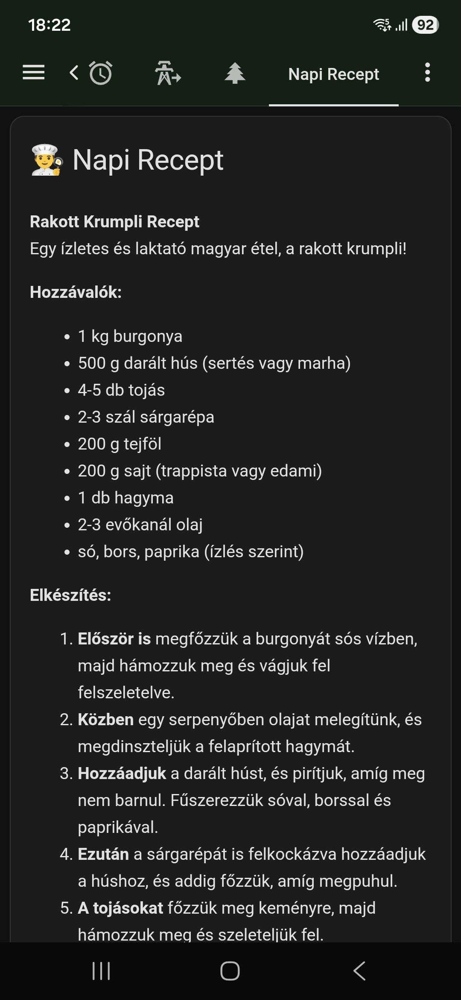

# Mit főzzek ma. AI által generált recept kiíratása UI-ra
Garantáltan asszonyfaktor növelő elem a Home Assistantba :smile:

Nálunk a HA-ba már egy ideje be van integrálva az OpenAI. Próbálom sulykolni a családot, hogy használják, kérdezzenek tőle. Azt is mondtam a feleségemnek, hogy ha nincs ötlete, hogy mit főzzön kérdezze meg az AI-t, hogy van e valami jó ötlete. Ez idáig ok. Az AI elmondja a receptet, el is ismételheti, de szar mindig kérdezgetni, ha elfelejtesz valamit. Azt akartam megoldani, hogy a receptet a dashboard egy meghatározott helyére írja ki. Így főzés közben bármikor visszanézhető az utoljára kért recept. 

Ehhez egy eseményvezérelt (trigger-based) Template Senzort fogunk használni. Ennek az a hatalmas előnye, hogy bármilyen hosszú szöveget be lehet tölteni.

### És akkor íme a hozzávalók: ### 

### 1. Az angol Prompt az OpenAI-hoz ###

Nálunk kétfajta OpenAI Conversation van. Egy angol és egy magyar. Itt most a magyar OpenAI Conversation beállításait irom le. 
Másold be ezt a szöveget az OpenAI Conversation integráció utasítás (prompt) mezőjébe:

#### When the user asks for a recipe, generate the complete food recipe including ingredients and step-by-step instructions. You MUST use the available tool/script named 'Show recipe on ui' to pass the full text of this recipe to the dashboard. ####

Ha akarod még kiegészítheted ezekkel is: 
#### Important: Do NOT read the full recipe out loud. Verbally, you must reply ONLY with this short confirmation in Hungarian: "A kért receptet megjelenítettem a telefonodon." ####

Nálam így néz ki:


### 2. A Script létrehozása ### 

Ezt fogja meghívni az OpenAI. A script annyit csinál, hogy fogadja a szöveget, és egy eseményként (event) elküldi a Home Assistant rendszerébe, amit majd a szenzor elkap. Ne felejtsd el bepipálni ezt a scriptet az OpenAI agent "Engedélyezett eszközök" (Exposed entities/tools) listájában!

```yaml
alias: Show recipe on ui
description: Ezt hívja meg az OpenAI, hogy átadja a receptet.
sequence:
  - event: update_recipe_display
    event_data:
      recipe_content: "{{ recipe_text }}"
mode: single
fields:
  recipe_text:
    selector:
      text:
        multiline: true
    name: Recipe text
    description: The full text of the generated recipe.
    required: true

```

### 3. A Template Senzor létrehozása (configuration.yaml) ### 
Ezt a kódot a Home Assistantod configuration.yaml fájljába kell bemásolnod. Ez hozza létre a szenzort, ami figyel egy egyedi eseményre, és eltárolja a hosszú receptet az attribútumában. (Ne felejtsd el újraindítani a Home Assistantot a módosítás után!)

```yaml

template:
  - trigger:
      - trigger: event
        event_type: update_recipe_display
    sensor:
      - name: "Konyhai Recept"
        unique_id: konyhai_recept_tarolo
        state: "{{ now().strftime('%H:%M') }}"
        attributes:
          recept_szoveg: "{{ trigger.event.data.recipe_content }}"

```

### 4. A Dashboard Kártya (Lovelace UI) ### 

A konyhai tableted/telefonod dashboardjára tegyél ki egy Markdown kártyát. Ez a kártya kiolvassa a szenzor attribútumát, és megjeleníti a szöveget.

```yaml

type: markdown
title: 👨‍🍳 Napi Recept
content: >-
  {{ state_attr('sensor.konyhai_recept', 'recept_szoveg') | default('Még nincs megjelenítendő recept. Kérj egyet a hangasszisztenstől!', true) }}

```

### Hogyan működik? ### 

Amikor kérsz egy receptet, az OpenAI meghívja a Show recipe on ui scriptet. A script elindít egy update_recipe_display nevű belső eseményt a recept szövegével. A Template Senzor ezt azonnal észreveszi, elmenti magába a szöveget, a dashboardon lévő Markdown kártya pedig abban a pillanatban frissül. Stabil, natív, és nem kell hozzá semmilyen külső bővítmény!

### És az eredmény a telefonomon: ### 


